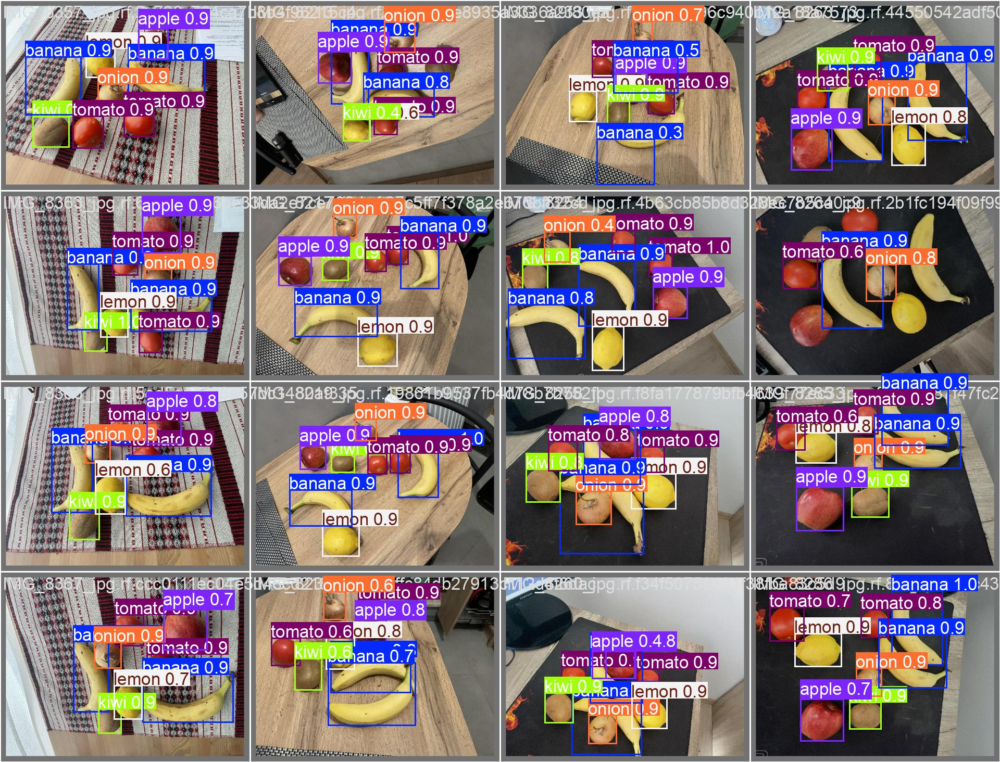
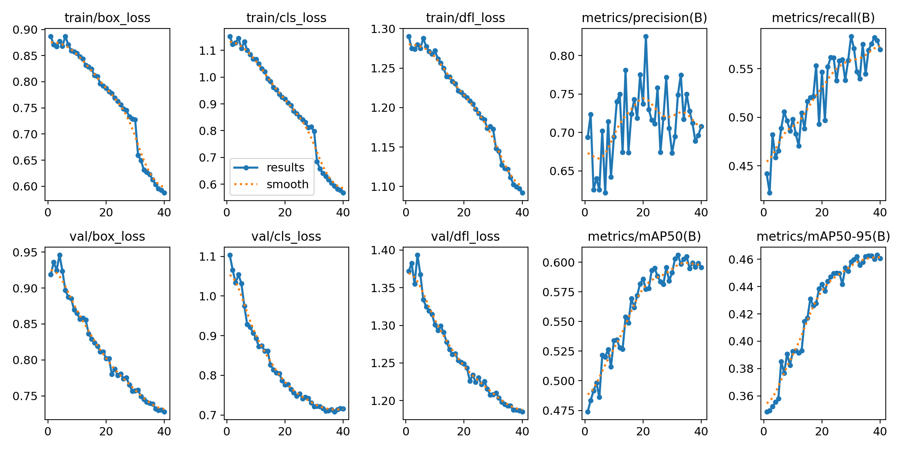
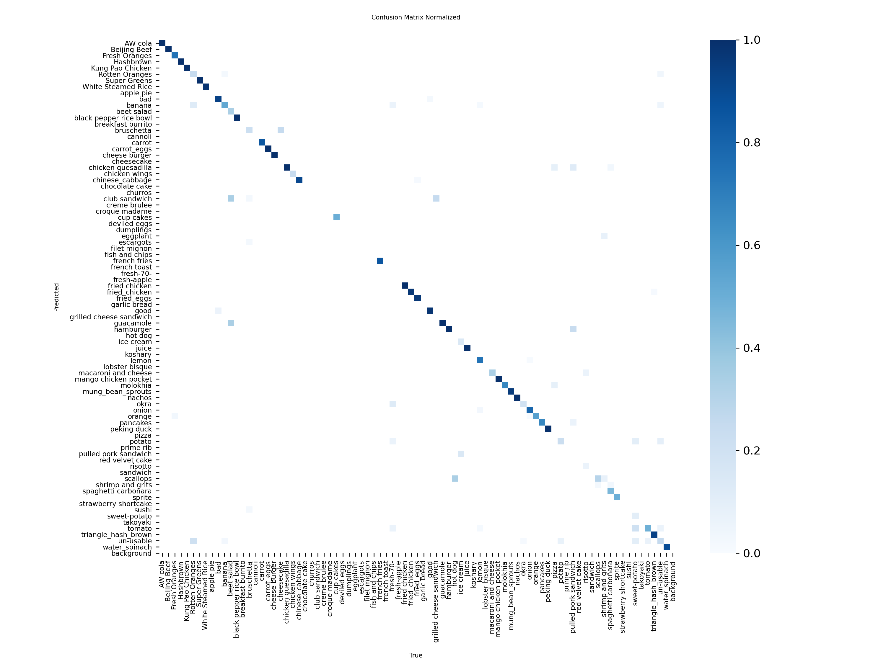
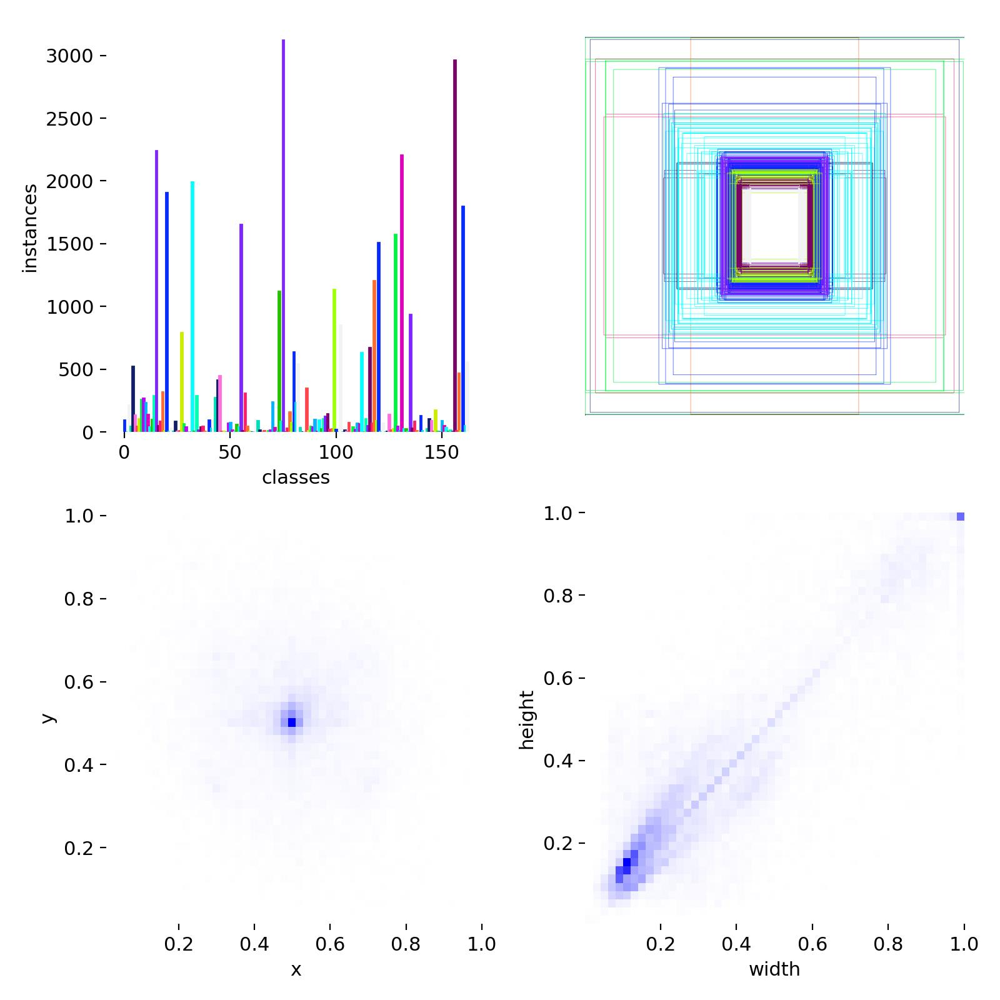

# 🍎 음식 인식 영양 분석기 (Food Recognition & Nutritional Analyzer)



YOLOv8 딥러닝 모델을 활용하여 사진 속 음식을 자동으로 인식하고, 해당 음식의 실시간 영양 정보(칼로리, 탄수화물, 단백질, 지방)를 분석해 주는 Streamlit 웹 애플리케이션입니다.

---

## 📽️ Project Overview
본 프로젝트는 현대인의 식습관 관리를 돕기 위해 기획되었습니다. 사용자가 식사 사진을 촬영하거나 업로드하면, 인공지능이 음식의 종류와 개수를 파악하고 공신력 있는 API를 통해 영양 정보를 즉각적으로 제공합니다.

### 🚀 핵심 기능
- **YOLOv8 기반 정밀 탐지**: 고성능 객체 탐지 알고리즘을 통해 다양한 음식을 실시간으로 식별합니다.
- **FatSecret API 연동**: 전 세계적으로 통용되는 영양 데이터베이스를 활용한 신뢰도 높은 정보 제공.
- **Total Nutrition Report**: 한 접시에 담긴 여러 음식을 합산하여 총 칼로리와 탄단지 비율을 계산합니다.
- **Interactive UI**: Streamlit을 통한 직관적이고 반응성이 뛰어난 사용자 경험.

---

## 📊 Model Performance & Analysis

학습 과정에서 모델의 안정성과 정확도를 확보하기 위해 다양한 지표를 모니터링하였습니다.

### 1. Training & Validation Metrics

- **Loss Convergence**: Box, Class, DFL 손실 함수가 에포크(Epoch)가 반복됨에 따라 안정적으로 수렴함을 확인하였습니다.
- **mAP(Mean Average Precision)**: 학습 후반부로 갈수록 mAP50 및 mAP50-95 지표가 우상향하여 높은 탐지 정밀도를 기록하였습니다.

### 2. Confusion Matrix Analysis

- 모델이 각 음식 클래스를 얼마나 정확하게 구분하는지 분석하였습니다. 
- 대각선 행렬의 높은 활성화를 통해 대부분의 음식을 명확하게 분류하고 있음을 증명합니다.

### 3. Dataset Distribution

- Food-101 데이터셋을 기반으로 다양하고 균형 잡힌 학습 데이터를 구성하여 일반화 성능을 극대화하였습니다.

---

## 🛠 Tech Stack
- **Deep Learning**: Python, Ultralytics YOLOv8
- **Frontend/Backend**: Streamlit
- **API/Database**: FatSecret Platform API, JSON
- **Data Processing**: PIL, NumPy, Pandas

---

## 📦 Installation & Setup

1. **라이브러리 설치**
   ```bash
   pip install -r requirements.txt
   ```

2. **환경 변수 설정 (`.env`)**
   ```env
   CLIENT_ID=YOUR_API_ID
   CLIENT_SECRET=YOUR_API_SECRET
   ```

3. **애플리케이션 실행**
   ```bash
   streamlit run streamlit.py
   ```

---

## 👨‍💻 Author & Reference
- **Developer**: 유재복 (Ash Fortune)
- **Repository**: [GitHub Link Placeholder]
- **Data Source**: Food-101 Dataset / FatSecret API
